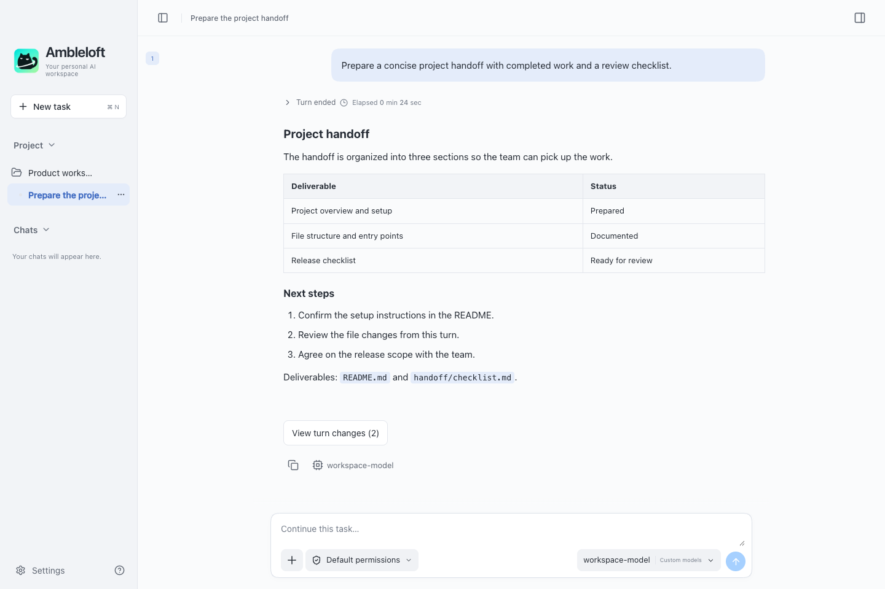
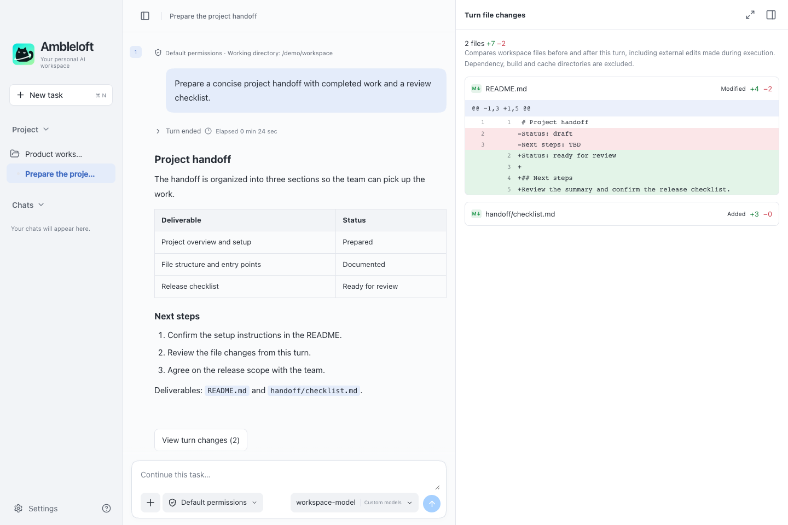
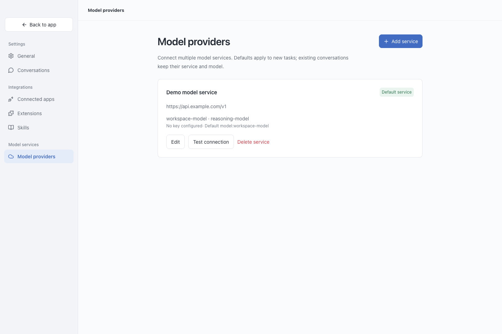

<div align="center">
  
  <h1>Ambleloft</h1>
  <p>An open-source, extensible Agent workspace.</p>
  <p><strong>English</strong> · <a href="README.zh-CN.md">简体中文</a></p>
  <p>v0.2.1 Preview · macOS · Apache-2.0</p>
</div>

**Ambleloft is a free, open-source desktop Agent workspace for everyday work.** Bring your own model service, give the agent project context, and work through tasks with conversations, files, approvals, and results in one place.

Use it to understand a codebase, organize documents, prepare a handoff, or explore data. The core is general-purpose; domain-specific workflows can be built through skills, extensions, and custom integrations.



*Screenshots show the current application UI with synthetic demonstration content and a mocked desktop bridge. The sample model and endpoint are illustrative, not a live provider or benchmark.*

## From a task to a reviewable result

| Capability | What is available today |
| --- | --- |
| Your models | Multiple local, private-network, or cloud endpoints; Responses API and Chat Completions adaptation; model selection and connection tests. |
| Project context | Folder-linked conversations, keyboard-accessible project selection, file/folder attachments, and a side-by-side file browser. |
| Visible execution | Streamed responses, available reasoning summaries, tool activity, task plans, questions, approvals, and stopping tasks. |
| File review | Per-turn file-change summaries and read-only text diffs, including added, modified, and deleted files. |
| Rich results | Markdown, code, equations, Mermaid, ECharts, SVG, basic draw.io, and supported file previews with expandable dialogs. |
| Conversation continuity | Local SQLite history, per-turn model and skill details, answer copying, drafts, archive search/filtering, restore, and confirmed bulk deletion. |
| Reusable skills | Create, import, edit, enable, and select local SKILL.md bundles for tasks. |
| Personal workspace | English / Simplified Chinese, light / dark / system appearance, collapsible panels, and adjustable text size. |

### Review what changed

Open a turn's change summary to inspect text additions and deletions without leaving the conversation. Changes compare the working directory before and after a turn, so they can include external edits made during execution. Snapshots are bounded and omit dependency/build/cache directories; some files show status only. This is a review view, not a Git commit or rollback tool.



### Choose your model service

Connect existing services and keep provider configuration in the workspace. Model capabilities and tool support vary by endpoint; per-model image-input settings help describe those capabilities.



## Open core, extensible workflows

- **Desktop core:** free and Apache-2.0 licensed. Use your own compatible model endpoint without waiting for an official hosted platform.
- **Skills:** reusable task instructions and local supporting resources.
- **Extensions:** an experimental declarative slice supports local JSON manifests with plain-text views and navigation commands. It does not execute extension scripts or provide a marketplace. See the [extension example and current limits](examples/extensions/README.md).
- **Commercial and custom services:** hosted model/plugin services and planned team collaboration are separate from the open desktop core. Research and medical-imaging solutions are partner customizations built on the general workspace, not built-in capabilities claimed by this preview.

## Preview scope

**The current package version is 0.2.1 Preview.** It is under active development, not a stable release. macOS Apple Silicon is the currently validated desktop target. Windows and Linux are targets, but the current packaging workflow does not provide their releases.

Ambleloft connects to existing endpoints. Model downloads and inference-runtime management are outside the current product scope. Team collaboration, marketplace installation, executable extensions, and application connectors are not implemented. Provider compatibility depends on the actual model and protocol.

See [the preview notes](CHANGELOG.md) for the latest changes and known boundaries.

## Run from source

Requirements: macOS, **Node.js 22.13+** (Node.js 24 LTS recommended), and npm. The engine preparation step builds for the host architecture.

```bash
git clone https://github.com/fjb040911/Ambleloft.git
cd Ambleloft
npm ci
npm run engine:prepare
npm run dev
```

Ambleloft uses the pinned Codex app-server runtime from the official npm package. You do not need to install the Codex CLI or the official Codex/ChatGPT desktop apps. The runtime is downloaded/prepared locally and is not committed to this repository.

For a production frontend build:

```bash
npm run build
npm start
```

`npm run dev:web` starts a browser-only UI preview. Native filesystem access and agent execution require the desktop app.

## Connect a model

1. Open **Settings → Model providers → Add service**.
2. Enter the provider's Base URL, exact model ID, and API key. A local service without authentication may use an empty key.
3. Choose the appropriate protocol, save, and test the connection. Connection tests send a small request and may incur provider charges.
4. Start a conversation, optionally selecting a project folder, and send a task.

Use a base URL such as `https://api.example.com/v1`, without appending `/responses` or `/chat/completions`. Public endpoints require HTTPS; HTTP is allowed for supported localhost and private-network addresses. Agent tasks require compatible tool calling. Native web search requires a Responses provider that supports it.

## Data and execution

“Local-first” describes where the workspace is stored; it does **not** mean every model runs locally. Prompts, selected files, and tool context may be sent to your configured model service.

- API keys are encrypted using Electron safeStorage and are not returned to the renderer.
- The default execution mode starts read-only and asks for approval when writes or elevated access are required. Optional full access allows actions without individual approval.
- A project folder is working context, not a guarantee that it is the only readable location.
- The app maintains a separate engine configuration and does not reuse the official Codex application's login or configuration.
- For compatibility with earlier development builds, macOS data remains under `~/Library/Application Support/Atelier`, including `atelier.sqlite` and a separate `codex-home`. Browser preview data is separate.

## Build a Mac application

```bash
npm run package:mac   # Build the .app for the current Mac architecture
npm run dist:mac      # Build .app, DMG, ZIP and checksums in release/
```

Local packages use ad-hoc signing and are not Apple-notarized distribution builds. For a signed and notarized release, configure Developer ID signing and Apple notarization credentials, then run `npm run release:mac`.

## Development and validation

Built with Electron, React, TypeScript, and Vite.

```bash
npm test                         # Unit and local integration tests
npx playwright install chromium
npm run test:e2e                  # Browser UI tests
npm run test:desktop              # Desktop smoke test with a local model fixture
npm run test:codex                # Pinned engine integration tests
npm run test:credentials          # Credential persistence across restarts
node scripts/capture-readme.mjs   # Recreate screenshots using installed Chrome and demo data
```

Desktop checks run on macOS and may use the system keychain. Local test fixtures do not establish compatibility with every external model provider.

Internal planning (`docs/`), generated deliverables (`output/`, `outputs/`), dependencies, runtime binaries, user data, and build outputs are intentionally excluded from Git. Runtime assets are prepared by the setup/build scripts.

## Feedback and contributions

Please [open an issue](https://github.com/fjb040911/Ambleloft/issues) with reproduction steps, app version, macOS version, and provider/protocol details. Remove API keys, private files, and sensitive conversation content before sharing logs. Discuss substantial changes in an issue before starting a pull request.

## License and acknowledgements

Ambleloft is licensed under [Apache-2.0](LICENSE). Third-party components retain their own licenses; see [THIRD_PARTY_NOTICES.md](THIRD_PARTY_NOTICES.md).

Ambleloft is an independent project, not an official OpenAI product. It uses the Codex runtime, Electron, React, Vite, Lucide, and other open-source libraries.
