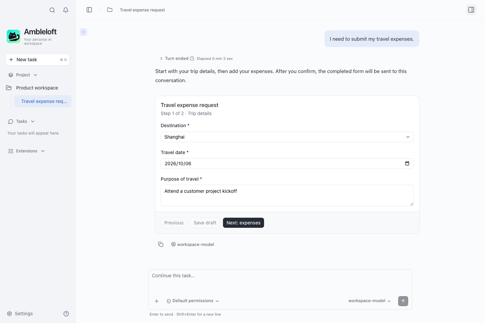
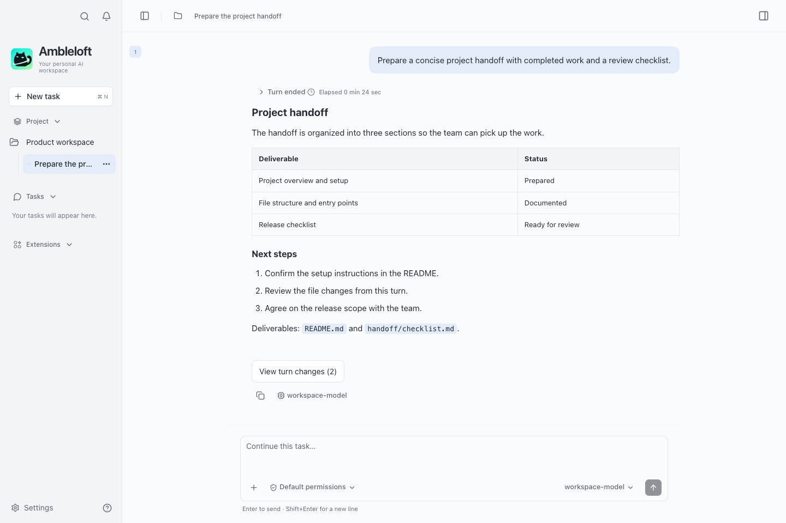

<div align="center">
  
  <h1>Ambleloft</h1>
  <p><strong>Build interactive Agent applications.</strong></p>
  <p>Bring forms, interfaces, and business operations into AI conversations.</p>
  <p><strong>English</strong> · <a href="README.zh-CN.md">简体中文</a></p>
  <p>Open-source desktop workspace · Your models · JavaScript / TypeScript extensions · Apache-2.0</p>
  <p><a href="#try-the-travel-expense-form">Try an example app</a> · <a href="#build-your-first-extension">Build your first extension</a></p>
</div>

**You build the business capabilities. Ambleloft provides the interface and runtime for people and agents to work together.** Turn a request into a workflow where users fill in information, confirm actions, and review results inside the conversation. Build extensions with familiar JavaScript / TypeScript tools and npm packages.

Targeting **Windows, macOS, and Linux**. Currently a **0.3.0 development preview**, validated on macOS Apple Silicon; Windows and Linux packages are not available yet. Extension capabilities below describe the current source. Run from source to try the latest features.

## From a request to an application

> **User:** I need to submit my travel expenses.
>
> **Agent:** Presents a travel expense form.
>
> **User:** Selects a location, enters an amount and date, reviews the information, and confirms.
>
> **App:** Sends the structured information back to the conversation for the next step.

You can try this with the repository's [travel expense example](examples/skills/travel-expense/SKILL.md). Users interact with real controls, with fields, validation, and submission behavior defined by a template. This example sends information to the chat; it does not submit a claim to an expense service.

To connect a business system, route form submissions to an extension's backend operation. Declarative forms support linear multi-step flows, saved drafts, and submission confirmation. For a custom interface, the limited MCP Apps adapter can display extension-provided HTML/JS inside a task.

[Explore the forms guide](specs/extensions/declarative-forms-guide.md) · [See the in-chat UI example](examples/extensions/task-form/README.md)



*The current UI with synthetic data and a two-step example template. The screenshot shows step 1, trip details; step 2 collects expenses. The bundled travel Skill is a simpler single-step example. Neither demonstration submits to an expense service.*

## Three layers for your Agent application

### Make conversation the entry point

Use a Skill to describe when the agent should use your capability, a form or task UI to collect input, and an extension operation to execute business logic. Ship the interface, agent-callable operations, and backend together in one extension.

An expense form needs amounts and dates. A service request needs a project and a description. You define the information your app needs; the workspace provides rendering, validation, and confirmation interactions.

### Build with the npm ecosystem

Reuse libraries for data processing, document generation, and service integrations. Extensions have user-trusted Node.js backends and isolated frontend pages. Include runtime dependencies in the extension package or bundle them into your build.

Users do not need to run npm or install system Node to install an extension. Developers prepare dependencies ahead of time; native modules still require target-platform and host ABI compatibility checks.

### Give users a shared place to work

Ambleloft provides project context, model connections, conversation history, execution approvals, and result review. Extensions can declare settings, business operations, and message actions, using the host's permission checks and interaction mechanisms.

**Next direction: extensions that work alongside an associated task.** We want extensions to follow task progress and turn conversation content into summaries, action items, and business records. A public task subscription / Agent hook SDK is not available yet; this is a roadmap direction.

## Build your first extension

Start with the repository's TypeScript example to see how a page, backend operations, and manifest work together. After setting up the source environment below, run:

```bash
npm run extensions:sdk
npm run extensions:demo
```

Follow the [example instructions](examples/extensions/project-card/README.md) to install the generated extension, then adapt its interface and business logic.

| What you want to build | Start here |
| --- | --- |
| Fields and multi-step forms in chat | [Declarative forms guide](specs/extensions/declarative-forms-guide.md) |
| Custom HTML/JS inside a task | [In-chat UI example](examples/extensions/task-form/README.md) |
| A standalone page with backend operations | [Project Card example](examples/extensions/project-card/README.md) |
| Message actions and business authentication | [Message actions and authentication](specs/extensions/message-actions-auth-guide.md) |
| SDK setup, dependencies, validation, and packaging | [Extension developer guide](specs/extensions/developer-guide.md) |

The SDK and extension APIs are developer previews. The repository SDK builds into a local npm package and is not published to the public npm registry. An extension marketplace is not implemented yet. Linked extension guides are currently primarily in Chinese.

## What the workspace already provides

| Capability | Use it in your workflow |
| --- | --- |
| Your models | Connect compatible local, private-network, or cloud endpoints; configure multiple services with Responses API and Chat Completions adaptation. |
| Project context | Link project folders, attach files, and browse files beside the conversation. |
| Visible execution | Follow streamed responses, tool activity, task plans, questions, and approvals; stop tasks when needed. |
| Result review | Render Markdown, code, equations, Mermaid, ECharts, SVG, and basic draw.io; inspect per-turn file changes and read-only diffs. |
| Conversation continuity | Local SQLite history, drafts, archive search and restore, plus per-turn model and skill details. |
| Reusable skills | Create, import, edit, and select local SKILL.md bundles. |
| Desktop experience | English and Simplified Chinese, light and dark themes, collapsible panels, and supported file and Office previews. |

File diffs compare directory snapshots before and after a turn. They can include external edits and have size and count limits. They support review, not Git commits or rollback.



*Current application UI with synthetic project content and a mocked desktop bridge.*

## Current status and roadmap

| Status | Scope |
| --- | --- |
| Available in current source | In-chat forms, linear multi-step flows, drafts and confirmed submissions, Node.js extension backends, isolated pages, business operations, settings, message actions, and OIDC authentication integration. |
| Limited preview | MCP Apps task UI; this does not imply arbitrary remote MCP or full ChatGPT Apps compatibility. |
| Future direction | Extensions subscribing to associated task conversations and progress for summaries and follow-up business workflows. No public Agent hook SDK yet. |
| Target platforms | Windows, macOS, and Linux. Only macOS Apple Silicon is currently validated; the packaging workflow does not provide Windows or Linux releases. |

The project is under active development and APIs are not stable. Previously published 0.2.1 installers may not include these capabilities. Ambleloft connects existing model endpoints; model downloads and inference-runtime management are outside the current scope.

[Current capabilities and contracts](specs/extensions/current-capabilities.md) · [Changelog](CHANGELOG.md)

## Try the travel expense form

1. Run the desktop app from source using the steps below and connect a model with compatible tool calling.
2. Import `examples/skills/travel-expense` in the skill manager.
3. Select the skill in a new task and ask, “I need to submit my travel expenses.”
4. Fill in the form the agent presents and confirm to send the information to the chat.

## Run from source

Requirements: macOS, **Node.js 22.13+** (Node.js 24 LTS recommended), and npm. The engine preparation step builds for the host architecture.

```bash
git clone https://github.com/fjb040911/Ambleloft.git
cd Ambleloft
npm ci
npm run engine:prepare
npm run dev
```

Ambleloft uses the pinned Codex app-server runtime from the official npm package. You do not need to install the Codex CLI or the official Codex/ChatGPT desktop apps. The runtime is downloaded/prepared locally and is not committed to this repository.

For a production frontend build:

```bash
npm run build
npm start
```

`npm run dev:web` starts a browser-only UI preview. Native filesystem access and agent execution require the desktop app.

<details>
<summary>Office previews: dependencies and supported features</summary>

## Office previews

The desktop app previews `.xlsx` / `.xls` workbooks and `.pptx` / `.ppt` presentations from the project file panel or the preview button on a delivered file. Previews are read-only.

- Excel: worksheet tabs, formatted saved cell values, and virtualized rows. Formula recalculation, charts, merged-cell layout, and full Excel styling are not included.
- PowerPoint: slide thumbnails, page navigation, fit/percentage zoom, and PPTX speaker notes. Legacy `.ppt` files display slides without notes. Animations are not played; font substitution can affect appearance.
- PowerPoint conversion requires **LibreOffice** on the user's machine. On macOS, install it in `/Applications` or `~/Applications`; other installations can use `PATH` or the `AMBLELOFT_SOFFICE` environment variable. LibreOffice is not bundled with Ambleloft. Missing installations show an actionable error and leave external opening available.
- Visible files are checked every two seconds. Changes are debounced before conversion; the last successful preview remains visible while updating or after an error. The refresh button retries. Files outside the active preview are converted when opened.
- Content-based previews are cached under the app's `office-preview` data directory (up to 12 recent entries). Conversion uses a separate temporary profile and does not modify the source document.
- Limits: 32 MiB source files, 500 PPTX slides, up to 100 sheets / 10,000 rows / 200 columns, 200,000 cells overall, and an approximate 8 MiB text budget. Truncated spreadsheet previews are labeled.

After building, run `npm run test:office` for a real Electron/LibreOffice preview smoke test. Unit tests cover parsing, cache reuse, conversion failures, and file access boundaries.

</details>

## Connect a model

1. Open **Settings → Model providers → Add service**.
2. Enter the provider's Base URL, exact model ID, and API key. A local service without authentication may use an empty key.
3. Choose the appropriate protocol, save, and test the connection. Connection tests send a small request and may incur provider charges.
4. Start a conversation, optionally selecting a project folder, and send a task.

Use a base URL such as `https://api.example.com/v1`, without appending `/responses` or `/chat/completions`. Public endpoints require HTTPS; HTTP is allowed for supported localhost and private-network addresses. Agent tasks require compatible tool calling. Native web search requires a Responses provider that supports it.

## Data and execution

“Local-first” describes where the workspace is stored; it does **not** mean every model runs locally. Prompts, selected files, and tool context may be sent to your configured model service.

- API keys are encrypted using Electron safeStorage and are not returned to the renderer.
- The default execution mode starts read-only and asks for approval when writes or elevated access are required. Optional full access allows actions without individual approval.
- A project folder is working context, not a guarantee that it is the only readable location.
- The app maintains a separate engine configuration and does not reuse the official Codex application's login or configuration.
- For compatibility with earlier development builds, macOS data remains under `~/Library/Application Support/Atelier`, including `atelier.sqlite` and a separate `codex-home`. Browser preview data is separate.

## Build a Mac application

```bash
npm run package:mac   # Build the .app for the current Mac architecture
npm run dist:mac      # Build .app, DMG, ZIP and checksums in release/
```

Local packages use ad-hoc signing and are not Apple-notarized distribution builds. For a signed and notarized release, configure Developer ID signing and Apple notarization credentials, then run `npm run release:mac`.

## Development and validation

Built with Electron, React, TypeScript, and Vite.

```bash
npm test                         # Unit and local integration tests
npx playwright install chromium
npm run test:e2e                  # Browser UI tests
npm run test:desktop              # Desktop smoke test with a local model fixture
npm run test:codex                # Pinned engine integration tests
npm run test:credentials          # Credential persistence across restarts
node scripts/capture-readme.mjs   # Recreate screenshots using installed Chrome and demo data
```

Desktop checks run on macOS and may use the system keychain. Local test fixtures do not establish compatibility with every external model provider.

Internal planning (`docs/`), generated deliverables (`output/`, `outputs/`), dependencies, runtime binaries, user data, and build outputs are intentionally excluded from Git. Runtime assets are prepared by the setup/build scripts.

## Feedback and contributions

Please [open an issue](https://github.com/fjb040911/Ambleloft/issues) with reproduction steps, app version, operating system version, and provider/protocol details. Remove API keys, private files, and sensitive conversation content before sharing logs. Discuss substantial changes in an issue before starting a pull request.

## License and acknowledgements

Ambleloft is licensed under [Apache-2.0](LICENSE). Third-party components retain their own licenses; see [THIRD_PARTY_NOTICES.md](THIRD_PARTY_NOTICES.md).

Ambleloft is an independent project, not an official OpenAI product. It uses the Codex runtime, Electron, React, Vite, Lucide, and other open-source libraries.
