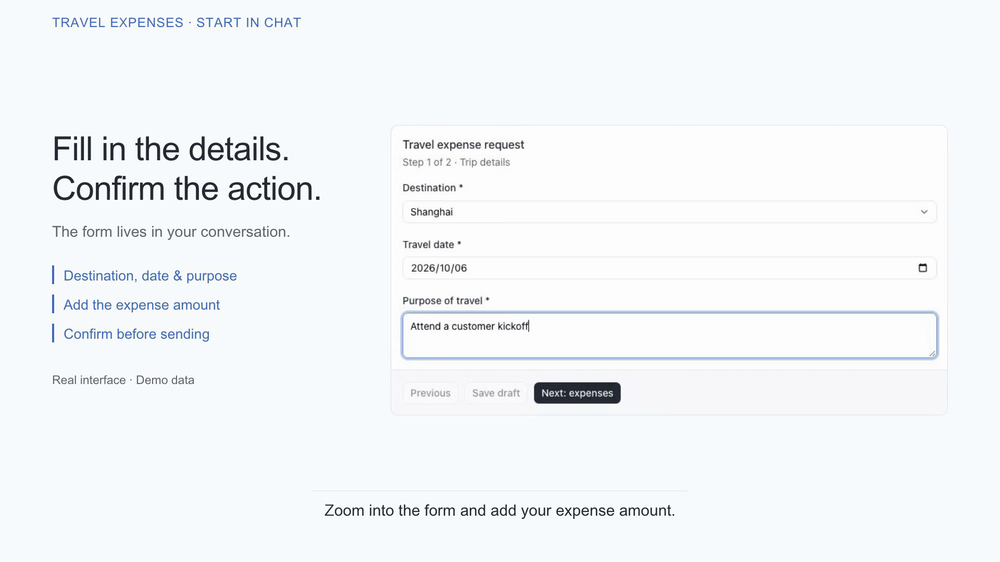
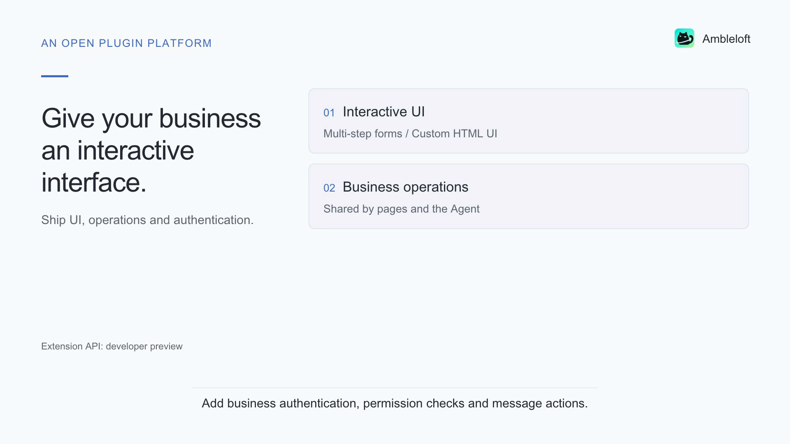

<div align="center">
  
  <h1>Ambleloft</h1>
  <p><strong>Bring your apps into AI conversations.</strong></p>
  <p><a href="https://ambleloft.com/">Official website</a> · <a href="#build-your-first-extension">Build an extension</a> · <a href="specs/README.md">Documentation</a></p>
  <p><strong>English</strong> · <a href="README.zh-CN.md">简体中文</a></p>
</div>

Ambleloft is an open-source platform for connecting your apps to AI agents. Build extensions that let users fill out forms, confirm actions, and follow business progress in chat.

[](https://github.com/fjb040911/Ambleloft/releases/download/v0.3.1/ambleloft-intro-en.mp4)

**Watch the 80-second introduction:** [English](https://github.com/fjb040911/Ambleloft/releases/download/v0.3.1/ambleloft-intro-en.mp4) · [简体中文](https://github.com/fjb040911/Ambleloft/releases/download/v0.3.1/ambleloft-intro-zh-CN.mp4). Both videos have captions and no audio.

*Real application UI with demo data and a simulated desktop bridge. The video shows collecting travel details and returning them to chat, not a production reimbursement submission.*

## Your app, inside the conversation

### Let users act in chat

Present a form or custom interface when a user asks to do something. They can enter details, review choices, and confirm the next step in the conversation. Use declarative forms for linear, multi-step flows, or the supported MCP Apps subset for custom HTML/JS.

[Explore in-chat forms](specs/extensions/declarative-forms-guide.md)

### Let the Agent call your app

Wrap your existing APIs and business logic as extension operations. The same operation can serve your interface and the Agent. Ambleloft provides the runtime, permission checks, and confirmation interactions; your extension defines what the operation does.

[Build your first operation](https://github.com/fjb040911/ambleloft-extension-samples/blob/main/hello-operation/README.md)

### Bring progress back to the user

Subscribe to events from your business service and publish updates in the message center. Add action buttons so users can review a change and continue the workflow. The samples demonstrate SSE events and confirmed message actions.

[Explore service events](https://github.com/fjb040911/ambleloft-extension-samples/blob/main/service-events/README.md) · [Add message actions](https://github.com/fjb040911/ambleloft-extension-samples/blob/main/message-actions/README.md)

*These are events from your own service. Public subscriptions to chat turns and Agent lifecycle hooks are not available yet.*

## Build your first extension

Use JavaScript / TypeScript and npm packages to connect your app. Extensions combine isolated frontend pages with user-trusted Node.js backends. Bundle dependencies with the extension; users do not need to install Node or run npm. Native modules need platform and host ABI compatibility checks.

Start with the runnable [hello-operation sample](https://github.com/fjb040911/ambleloft-extension-samples/blob/main/hello-operation/README.md):

```bash
git clone https://github.com/fjb040911/ambleloft-extension-samples.git
cd ambleloft-extension-samples/hello-operation
npm ci
npm run build
npm run validate
npm test
npm run pack
```

In a compatible host, open **Settings → Extensions → Install**, select the package, confirm trust, and grant the required permissions. [Run the host from source](#run-from-source) for the current extension preview.

<details>
<summary>How an extension fits together</summary>



Use a Skill to describe when the Agent should use your capability, a form or page to collect input, and an operation to execute business logic. See the [current capabilities and contracts](specs/extensions/current-capabilities.md).

</details>

## Start with a working example

| Build this | Example |
| --- | --- |
| A multi-step form connected to a service | [Travel expense assistant](https://github.com/fjb040911/ambleloft-extension-samples/blob/main/expense-workflow/README.md) |
| A custom interface inside chat | [In-chat travel card](https://github.com/fjb040911/ambleloft-extension-samples/blob/main/mcp-apps-card/README.md) |
| Business progress updates | [Service events](https://github.com/fjb040911/ambleloft-extension-samples/blob/main/service-events/README.md) |
| Messages with confirmed actions | [Message actions](https://github.com/fjb040911/ambleloft-extension-samples/blob/main/message-actions/README.md) |
| Authenticated business integrations | [Authentication](https://github.com/fjb040911/ambleloft-extension-samples/blob/main/enterprise-auth/README.md) |
| Data processing with npm libraries | [CSV to JSON](https://github.com/fjb040911/ambleloft-extension-samples/blob/main/npm-data-transform/README.md) |

[Browse all examples](https://github.com/fjb040911/ambleloft-extension-samples)

<details>
<summary>Try the travel expense form</summary>
<a id="try-the-travel-expense-form"></a>

1. Start the host and connect a model with compatible tool calling.
2. Follow the [expense assistant guide](https://github.com/fjb040911/ambleloft-extension-samples/blob/main/expense-workflow/README.md) to build and install the extension.
3. Start its local demo service and configure the service URL in extension settings.
4. Ask to submit travel expenses, complete the three-step flow, and query the resulting records.

This sample uses fictional data and a local demo service. It also demonstrates read-only reconciliation after a lost response. The introduction video shows a separate two-step UI demo that returns input to chat.

</details>

## A workspace your extensions can build on

Ambleloft provides model connections, project files, conversation history, and execution approvals. Choose a compatible model service and bring the context your app needs.

| Foundation | Included |
| --- | --- |
| Models and context | Local, private-network, or cloud endpoints; Responses and Chat Completions adaptation; project folders and file attachments. |
| Execution and review | Tool activity, plans, approvals, stopping tasks, rich results, and per-turn file-change review. |
| Everyday work | Local history, archive search and restore, reusable Skills, file and Office previews. |
| Your workspace | English / Simplified Chinese, light / dark themes, adjustable panels, and grouped sidebar or activity-bar navigation. |

<details>
<summary>Workspace preview and navigation</summary>


*Application UI with synthetic project content and a simulated desktop bridge.*

Switch layouts in **Settings → General → Navigation layout**. The grouped sidebar is the default. Switching layouts or activity groups keeps your current conversation and draft. The activity bar uses icons with tooltips and separate project, task, and extension entry points. Standalone tasks are grouped by time. Narrow windows use a sidebar drawer with Escape-to-close and focus restoration.

File diffs compare directory snapshots before and after a turn. They may include external edits and have size and count limits. They support review, not Git commits or rollback.

</details>

## Current preview

**0.3.1 development preview.** Use the current source for the capabilities described here. The earlier 0.2.1 installers may not include them.

- **Platforms:** validated on macOS Apple Silicon. Windows and Linux are targets; packages are not available yet.
- **Extensions:** forms, operations, isolated pages, settings, message actions, and OIDC integration are developer previews. MCP Apps support is a limited subset, not full ChatGPT Apps or arbitrary remote MCP compatibility.
- **Tooling:** samples pin published SDK/CLI **0.1.0-alpha.7**. This repository's alpha.1 reference SDK is maintained separately. APIs are not stable; a marketplace and public Agent hook SDK are not available.

Ambleloft connects to existing model endpoints. Model downloads and inference-runtime management are outside the current scope. Model and external service charges are separate.

[Capability reference](specs/extensions/current-capabilities.md) · [Sample verification](https://github.com/fjb040911/ambleloft-extension-samples/blob/main/docs/verification.md) · [Changelog](CHANGELOG.md)

## Run from source

Requirements: macOS, **Node.js 22.13+** (Node.js 24 LTS recommended), and npm. The engine preparation step builds for the host architecture.

```bash
git clone https://github.com/fjb040911/Ambleloft.git
cd Ambleloft
npm ci
npm run engine:prepare
npm run dev
```

Ambleloft uses the pinned Codex app-server runtime from the official npm package. You do not need to install the Codex CLI or the official Codex/ChatGPT desktop apps. The runtime is downloaded/prepared locally and is not committed to this repository.

For a production frontend build:

```bash
npm run build
npm start
```

`npm run dev:web` starts a browser-only UI preview. Native filesystem access and agent execution require the desktop app.

<details>
<summary>Office previews: dependencies and supported features</summary>

## Office previews

The desktop app previews `.xlsx` / `.xls` workbooks and `.pptx` / `.ppt` presentations from the project file panel or the preview button on a delivered file. Previews are read-only.

- Excel: worksheet tabs, formatted saved cell values, and virtualized rows. Formula recalculation, charts, merged-cell layout, and full Excel styling are not included.
- PowerPoint: slide thumbnails, page navigation, fit/percentage zoom, and PPTX speaker notes. Legacy `.ppt` files display slides without notes. Animations are not played; font substitution can affect appearance.
- PowerPoint conversion requires **LibreOffice** on the user's machine. On macOS, install it in `/Applications` or `~/Applications`; other installations can use `PATH` or the `AMBLELOFT_SOFFICE` environment variable. LibreOffice is not bundled with Ambleloft. Missing installations show an actionable error and leave external opening available.
- Visible files are checked every two seconds. Changes are debounced before conversion; the last successful preview remains visible while updating or after an error. The refresh button retries. Files outside the active preview are converted when opened.
- Content-based previews are cached under the app's `office-preview` data directory (up to 12 recent entries). Conversion uses a separate temporary profile and does not modify the source document.
- Limits: 32 MiB source files, 500 PPTX slides, up to 100 sheets / 10,000 rows / 200 columns, 200,000 cells overall, and an approximate 8 MiB text budget. Truncated spreadsheet previews are labeled.

After building, run `npm run test:office` for a real Electron/LibreOffice preview smoke test. Unit tests cover parsing, cache reuse, conversion failures, and file access boundaries.

</details>

## Connect a model

1. Open **Settings → Model providers → Add service**.
2. Enter the provider's Base URL, exact model ID, and API key. A local service without authentication may use an empty key.
3. Choose the appropriate protocol, save, and test the connection. Connection tests send a small request and may incur provider charges.
4. Start a conversation, optionally selecting a project folder, and send a task.

Use a base URL such as `https://api.example.com/v1`, without appending `/responses` or `/chat/completions`. Public endpoints require HTTPS; HTTP is allowed for supported localhost and private-network addresses. Agent tasks require compatible tool calling. Native web search requires a Responses provider that supports it.

## Data and execution

“Local-first” describes where the workspace is stored; it does **not** mean every model runs locally. Prompts, selected files, and tool context may be sent to your configured model service.

- API keys are encrypted using Electron safeStorage and are not returned to the renderer.
- The default execution mode starts read-only and asks for approval when writes or elevated access are required. Optional full access allows actions without individual approval.
- A project folder is working context, not a guarantee that it is the only readable location.
- The app maintains a separate engine configuration and does not reuse the official Codex application's login or configuration.
- For compatibility with earlier development builds, macOS data remains under `~/Library/Application Support/Atelier`, including `atelier.sqlite` and a separate `codex-home`. Browser preview data is separate.

<details>
<summary>Packaging and development checks</summary>

## Build a Mac application

```bash
npm run package:mac   # Build the .app for the current Mac architecture
npm run dist:mac      # Build .app, DMG, ZIP and checksums in release/
```

Local packages use ad-hoc signing and are not Apple-notarized distribution builds. For a signed and notarized release, configure Developer ID signing and Apple notarization credentials, then run `npm run release:mac`.

## Development and validation

Built with Electron, React, TypeScript, and Vite.

```bash
npm test                         # Unit and local integration tests
npx playwright install chromium
npm run test:e2e                  # Browser UI tests
npm run test:desktop              # Desktop smoke test with a local model fixture
npm run test:codex                # Pinned engine integration tests
npm run test:credentials          # Credential persistence across restarts
node scripts/capture-readme.mjs   # Recreate screenshots using installed Chrome and demo data
```

Desktop checks run on macOS and may use the system keychain. Local test fixtures do not establish compatibility with every external model provider.

Internal planning (`docs/`), generated deliverables (`output/`, `outputs/`), dependencies, runtime binaries, user data, and build outputs are intentionally excluded from Git. Runtime assets are prepared by the setup/build scripts.

</details>

## Feedback and contributions

Please [open an issue](https://github.com/fjb040911/Ambleloft/issues) with reproduction steps, app version, operating system version, and provider/protocol details. Remove API keys, private files, and sensitive conversation content before sharing logs. Discuss substantial changes in an issue before starting a pull request.

## License and acknowledgements

Ambleloft is licensed under [Apache-2.0](LICENSE). Third-party components retain their own licenses; see [THIRD_PARTY_NOTICES.md](THIRD_PARTY_NOTICES.md).

Ambleloft is an independent project, not an official OpenAI product. It uses the Codex runtime, Electron, React, Vite, Lucide, and other open-source libraries.
