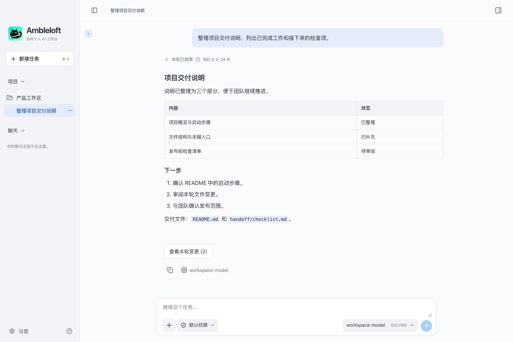
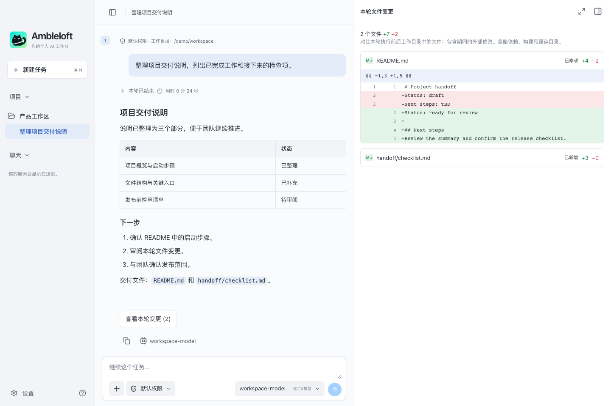
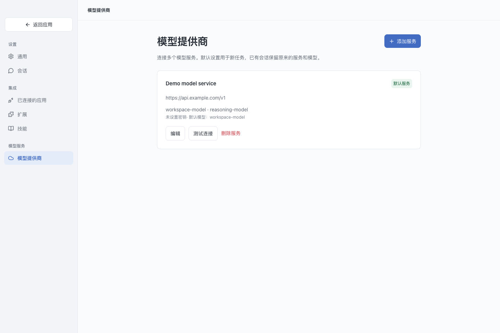

<div align="center">
  
  <h1>Ambleloft</h1>
  <p>免费开源、可扩展的 AI 工作台平台。</p>
  <p><a href="README.md">English</a> · <strong>简体中文</strong></p>
  <p>v0.2.1 预览版 · macOS · Apache-2.0</p>
</div>

**Ambleloft 是免费、开源、可扩展的桌面 AI 工作台平台。** 连接自己的模型服务，为 Agent 提供项目上下文，在同一工作区中完成对话、文件浏览、执行审批和结果审阅。

你可以用它理解代码库、整理文档、准备项目交付或探索数据。它采用类似 VS Code 的平台定位：提供通用工作区，通过技能、扩展和集成适配不同工作方式。扩展系统目前仍处于早期预览阶段。



*截图来自当前应用真实界面，使用虚构演示内容和模拟桌面接口。示例模型与端点仅用于展示，不代表真实服务连接或性能测试。*

## 从任务到可审阅的结果

| 能力 | 当前可用功能 |
| --- | --- |
| 自选模型 | 配置多个本地、局域网或云端服务；Responses API 与 Chat Completions 适配；模型选择及连接测试。 |
| 项目上下文 | 文件夹关联对话、支持键盘操作的项目选择、文件/文件夹附件，以及并排文件浏览。 |
| 执行可见 | 流式回答、可用的推理摘要、工具活动、任务计划、问题收集、操作审批和停止任务。 |
| 文件审阅 | 逐轮文件变更摘要与只读文本差异，展示新增、修改和删除。 |
| 丰富结果 | Markdown、代码、公式、Mermaid、ECharts、SVG、基础 draw.io，以及支持格式的文件预览与可展开窗口。 |
| 会话延续 | 本地 SQLite 历史、逐轮模型与技能信息、复制回复、草稿、归档搜索筛选、恢复及确认后的批量删除。 |
| 可复用技能 | 创建、导入、编辑、启用及为任务选择本地 SKILL.md 技能包。 |
| 个性工作区 | 中英文、浅色/深色/跟随系统、可折叠面板及文字大小调整。 |

### 审阅本轮修改

从对话打开文件变更摘要，直接检查文本增删。变更通过对比本轮执行前后的工作目录得到，也可能包含执行期间的外部修改。快照有大小和数量限制，并忽略依赖、构建和缓存目录；部分文件仅展示状态。这是审阅视图，不是 Git 提交或回滚工具。



### 连接自己的模型服务

连接已经运行的模型端点，在工作台中管理多个服务。模型能力和工具支持因服务而异；可按模型配置图片输入能力。



## 以扩展为基础的平台定位

- **桌面核心：**免费，使用 Apache-2.0 许可证，提供对话、项目上下文、执行审批和结果审阅等通用能力，可连接自己的兼容模型端点。
- **技能：**可复用的任务指令与本地辅助资源。
- **扩展：**当前为实验性的声明式子集，支持带纯文本视图和导航命令的本地 JSON 清单。尚不执行扩展脚本，也不提供商城。参见[扩展示例与能力边界](examples/extensions/README.md)。
- **专业工作流：**领域能力与外部服务通过扩展和集成接入，平台本身保持通用。

## 预览版范围

**当前软件包版本为 0.2.1 Preview。** 项目持续开发中，尚非稳定发行版。目前已验证的桌面目标为 macOS Apple Silicon。Windows、Linux 是目标平台，现有打包流程尚不提供相应发行包。

Ambleloft 连接现有端点，模型下载和推理运行时管理不在当前产品范围内。商城安装、可执行扩展和应用连接器尚未实现。实际兼容性取决于模型及服务协议。

最新变化和限制参见[预览版说明](CHANGELOG.md)。

## 从源码运行

需要 macOS、**Node.js 22.13+**（建议 Node.js 24 LTS）及 npm。引擎准备步骤使用当前机器的架构。

```bash
git clone https://github.com/fjb040911/Ambleloft.git
cd Ambleloft
npm ci
npm run engine:prepare
npm run dev
```

应用使用官方 npm 包中的固定版本 Codex app-server 引擎，无需另外安装 Codex CLI、官方 Codex 或 ChatGPT 桌面应用。引擎在本机下载、准备，不提交到本仓库。

运行生产前端构建：

```bash
npm run build
npm start
```

`npm run dev:web` 仅提供浏览器界面预览。本地文件访问和 Agent 执行需要桌面应用。

## Office 预览

桌面应用可从项目文件面板或交付文件的预览按钮打开 Excel（`.xlsx` / `.xls`）及 PowerPoint（`.pptx` / `.ppt`），预览均为只读。

- Excel 支持工作表切换、已保存的格式化单元格值及虚拟滚动；不重新计算公式，不完整还原图表、合并单元格和样式。
- PowerPoint 支持缩略图、翻页、缩放及 PPTX 演讲者备注；旧版 PPT 不显示备注，不播放动画，字体替换可能影响外观。
- PowerPoint 转换需要另外安装 **LibreOffice**，应用不内置该软件。macOS 可安装到 `/Applications` 或 `~/Applications`，也可通过 `PATH` 或 `AMBLELOFT_SOFFICE` 指定位置。未安装时会提示，仍可使用外部应用打开。
- 当前预览文件每两秒检查一次变化，更新失败时保留上次成功的预览，也可手动刷新。转换不修改源文件，缓存最多保留 12 个最近条目。
- 文件上限为 32 MiB；PPTX 最多 500 页；表格最多 100 个工作表、10,000 行、200 列，总计 200,000 个单元格，文本预算约 8 MiB。截断时会显示提示。

## 连接模型

1. 打开「设置 → 模型提供商 → 添加服务」。
2. 填入 Base URL、准确模型 ID 和 API Key；无鉴权的本地服务可留空密钥。
3. 选择适用协议，保存并测试连接。测试会发送少量请求，可能产生服务费用。
4. 新建对话，可选项目文件夹，然后发送任务。

Base URL 示例为 `https://api.example.com/v1`，不要追加 `/responses` 或 `/chat/completions`。公网端点要求 HTTPS；支持的本机与局域网地址可使用 HTTP。Agent 任务需要模型支持兼容的工具调用；原生网页搜索需要支持该能力的 Responses 服务。

## 数据与执行权限

「本地优先」描述工作台数据的存储方式，并不意味着模型一定在本地运行。提示词、所选文件和工具上下文可能发送到你配置的模型服务。

- API Key 通过 Electron safeStorage 加密保存，不回传渲染进程。
- 默认执行模式从只读开始，写入或提权需要审批。可选的完全访问模式允许不经逐次审批执行操作。
- 项目目录是工作上下文，并不保证它是唯一可读目录。
- 应用维护独立的引擎配置，不复用官方 Codex 的登录与配置。
- 为兼容早期开发版本，macOS 数据仍位于 `~/Library/Application Support/Atelier`，包含 `atelier.sqlite` 和独立的 `codex-home`。浏览器预览数据与桌面版分离。

## 构建 Mac 应用

```bash
npm run package:mac   # 构建当前 Mac 架构的 .app
npm run dist:mac      # 在 release/ 生成 .app、DMG、ZIP 和校验文件
```

本地包使用 ad-hoc 签名，不是经过 Apple 公证的正式分发版本。正式签名与公证发布需要配置 Developer ID 签名及 Apple 公证凭据，再运行 `npm run release:mac`。

## 开发与验证

技术栈：Electron、React、TypeScript 和 Vite。

```bash
npm test                         # 单元与本地集成测试
npx playwright install chromium
npm run test:e2e                  # 浏览器界面测试
npm run test:desktop              # 使用本地模拟模型服务的桌面冒烟测试
npm run test:codex                # 固定版本引擎集成测试
npm run test:credentials          # 重启后的密钥持久化验证
node scripts/capture-readme.mjs   # 使用已安装的 Chrome 和演示数据重新截图
```

桌面验证在 macOS 上运行，可能使用系统钥匙串。本地模拟服务测试不代表对所有第三方模型服务的兼容性保证。

内部规划 `docs/`、生成产物 `output/`、`outputs/`、依赖、引擎二进制、用户数据和构建输出不提交 Git。运行所需资源由初始化与构建脚本准备。

## 反馈与贡献

欢迎[提交 Issue](https://github.com/fjb040911/Ambleloft/issues)，附上复现步骤、应用版本、macOS 版本和模型服务/协议信息。分享日志前请移除密钥、私有文件及敏感对话。较大的改动请先通过 Issue 讨论，再提交 PR。

## 许可证与致谢

Ambleloft 使用 [Apache-2.0](LICENSE) 许可证。第三方组件保留各自许可证，参见 [THIRD_PARTY_NOTICES.md](THIRD_PARTY_NOTICES.md)。

Ambleloft 是独立项目，并非 OpenAI 官方产品。项目使用 Codex 引擎、Electron、React、Vite、Lucide 等开源组件。
