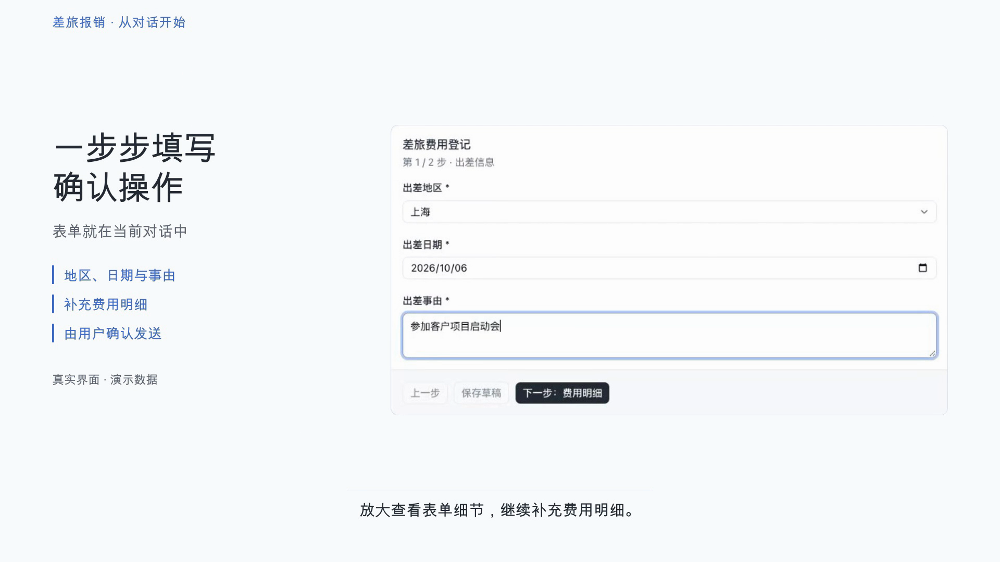
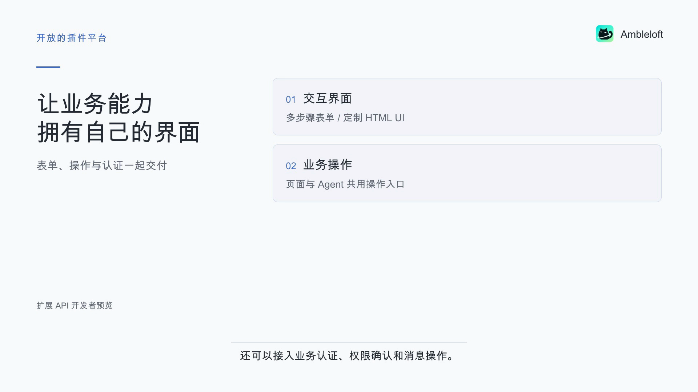

<div align="center">
  
  <h1>Ambleloft</h1>
  <p><strong>把你的应用，带进 AI 对话。</strong></p>
  <p><a href="https://ambleloft.com/">官方网站</a> · <a href="#开发第一个扩展">开发插件</a> · <a href="specs/README.md">阅读文档</a></p>
  <p><a href="README.md">English</a> · <strong>简体中文</strong></p>
</div>

Ambleloft 是连接应用与 AI Agent 的开源平台。通过插件，让用户在对话中填写表单、确认操作、跟进业务进展。

[](https://github.com/fjb040911/Ambleloft/releases/download/v0.3.1/ambleloft-intro-zh-CN.mp4)

**80 秒了解 Ambleloft：**[中文版](https://github.com/fjb040911/Ambleloft/releases/download/v0.3.1/ambleloft-intro-zh-CN.mp4) · [English](https://github.com/fjb040911/Ambleloft/releases/download/v0.3.1/ambleloft-intro-en.mp4)。两个版本均带字幕，无音轨。

*画面使用真实应用界面、演示数据和模拟桌面接口。视频展示填写差旅信息并将结果带回对话，不代表已向生产报销系统提交申请。*

## 让应用在对话中工作

### 让用户在聊天里办事

用户提出需求后，展示表单或自定义界面，让他们直接填写信息、核对选项并确认下一步。线性多步骤流程可以使用声明式表单；自定义 HTML/JS 界面可使用当前支持的 MCP Apps 协议子集。

[查看表单开发指南](specs/extensions/declarative-forms-guide.md)

### 让 Agent 调用你的应用

把已有 API 和业务逻辑封装成插件操作，同一个操作可供界面和 Agent 调用。Ambleloft 提供运行环境、权限校验和确认交互，插件定义具体的业务处理。

[编写第一个业务操作](https://github.com/fjb040911/ambleloft-extension-samples/blob/main/hello-operation/README.zh-CN.md)

### 让业务进展主动找人

订阅自己业务服务的事件，把进展送到消息中心。为消息附上操作按钮，让用户查看变化后继续处理。现有案例展示了 SSE 事件订阅和需经确认的消息操作。

[查看服务事件案例](https://github.com/fjb040911/ambleloft-extension-samples/blob/main/service-events/README.zh-CN.md) · [添加消息操作](https://github.com/fjb040911/ambleloft-extension-samples/blob/main/message-actions/README.zh-CN.md)

*这里订阅的是自有业务服务事件。聊天轮次内容订阅和公共 Agent 生命周期 Hook 尚未开放。*

## 开发第一个扩展

使用 JavaScript / TypeScript 和 npm 包连接你的应用。扩展包含隔离的前端页面和经用户信任后运行的 Node.js 后端。依赖随扩展交付，用户无需另装 Node 或运行 npm；原生模块需要适配目标平台和宿主 ABI。

从可运行的 [hello-operation 案例](https://github.com/fjb040911/ambleloft-extension-samples/blob/main/hello-operation/README.zh-CN.md)开始：

```bash
git clone https://github.com/fjb040911/ambleloft-extension-samples.git
cd ambleloft-extension-samples/hello-operation
npm ci
npm run build
npm run validate
npm test
npm run pack
```

在兼容宿主中打开「**设置 → 扩展 → 安装**」，选择生成的扩展包，确认信任并授予所需权限。体验当前扩展预览能力，请先[从源码运行宿主](#从源码运行)。

<details>
<summary>一个扩展如何组成</summary>



用 Skill 描述 Agent 何时使用你的能力，用表单或页面收集输入，再由操作执行业务逻辑。详见[当前能力与契约](specs/extensions/current-capabilities.md)。

</details>

## 从一个完整案例开始

| 你想实现的能力 | 示例 |
| --- | --- |
| 连接业务服务的多步骤表单 | [差旅报销助手](https://github.com/fjb040911/ambleloft-extension-samples/blob/main/expense-workflow/README.zh-CN.md) |
| 聊天内自定义界面 | [差旅交互卡片](https://github.com/fjb040911/ambleloft-extension-samples/blob/main/mcp-apps-card/README.zh-CN.md) |
| 业务进展通知 | [服务事件订阅](https://github.com/fjb040911/ambleloft-extension-samples/blob/main/service-events/README.zh-CN.md) |
| 带确认操作的消息 | [消息操作](https://github.com/fjb040911/ambleloft-extension-samples/blob/main/message-actions/README.zh-CN.md) |
| 需要认证的业务系统对接 | [认证接入](https://github.com/fjb040911/ambleloft-extension-samples/blob/main/enterprise-auth/README.zh-CN.md) |
| 使用 npm 库处理数据 | [CSV 转 JSON](https://github.com/fjb040911/ambleloft-extension-samples/blob/main/npm-data-transform/README.zh-CN.md) |

[浏览全部案例](https://github.com/fjb040911/ambleloft-extension-samples)

<details>
<summary>体验差旅表单</summary>
<a id="体验差旅表单"></a>

1. 启动宿主，连接支持兼容工具调用的模型。
2. 按[报销助手指南](https://github.com/fjb040911/ambleloft-extension-samples/blob/main/expense-workflow/README.zh-CN.md)构建并安装扩展。
3. 启动本地演示服务，在扩展设置中填写服务地址。
4. 在聊天中请求报销差旅费用，完成三步流程，再查询申请记录。

案例使用虚构数据和本地演示服务，也展示响应丢失后的只读核实流程。上方介绍视频使用另一套两步 UI 演示，将输入结果带回聊天。

</details>

## 扩展所需的工作台，已经准备好

Ambleloft 提供模型连接、项目文件、会话历史和执行审批。选择兼容的模型服务，为你的应用带入所需上下文。

| 基础能力 | 已提供 |
| --- | --- |
| 模型与上下文 | 本地、局域网或云端端点，Responses 与 Chat Completions 适配，项目目录和文件附件。 |
| 执行与审阅 | 工具活动、计划、审批、停止任务、丰富结果展示和逐轮文件变更审阅。 |
| 日常工作 | 本地历史、归档搜索与恢复、可复用技能、文件及 Office 预览。 |
| 个性工作区 | 中英文、浅色/深色主题、可调面板，以及分组侧栏或活动栏导航。 |

<details>
<summary>工作台预览与导航方式</summary>


*应用界面使用虚构项目内容和模拟桌面接口。*

在「**设置 → 通用 → 导航布局**」切换布局，默认使用分组侧栏。切换布局或活动栏分组会保留当前聊天和输入草稿。活动栏采用图标及悬浮提示，分别提供项目、任务和扩展入口；独立任务按时间分组。窄窗口使用侧栏抽屉，支持 Escape 关闭和焦点恢复。

文件差异通过比较本轮执行前后的目录快照生成，可能包含外部修改，并有大小和数量限制。它用于审阅，不执行 Git 提交或回滚。

</details>

## 当前预览范围

**0.3.1 开发预览。** 本文描述当前源码能力，早期 0.2.1 安装包可能不包含这些功能。

- **平台：**已验证 macOS Apple Silicon；Windows 和 Linux 为目标平台，尚未提供安装包。
- **扩展：**表单、操作、隔离页面、设置、消息操作及 OIDC 认证均处于开发者预览。MCP Apps 支持有限子集，不代表兼容完整 ChatGPT Apps 或任意远程 MCP。
- **工具：**示例固定使用已发布的 SDK/CLI **0.1.0-alpha.7**；本仓库的 alpha.1 参考 SDK 独立维护。API 尚未稳定，商城与公共 Agent Hook SDK 尚未开放。

Ambleloft 连接已有模型端点，不负责模型下载和推理运行时管理。模型及外部服务费用另计。

[能力参考](specs/extensions/current-capabilities.md) · [示例验证记录](https://github.com/fjb040911/ambleloft-extension-samples/blob/main/docs/verification.md) · [更新说明](CHANGELOG.md)

## 从源码运行

需要 macOS、**Node.js 22.13+**（建议 Node.js 24 LTS）及 npm。引擎准备步骤使用当前机器的架构。

```bash
git clone https://github.com/fjb040911/Ambleloft.git
cd Ambleloft
npm ci
npm run engine:prepare
npm run dev
```

应用使用官方 npm 包中的固定版本 Codex app-server 引擎，无需另外安装 Codex CLI、官方 Codex 或 ChatGPT 桌面应用。引擎在本机下载、准备，不提交到本仓库。

运行生产前端构建：

```bash
npm run build
npm start
```

`npm run dev:web` 仅提供浏览器界面预览。本地文件访问和 Agent 执行需要桌面应用。

<details>
<summary>Office 预览：依赖与支持范围</summary>

## Office 预览

桌面应用可从项目文件面板或交付文件的预览按钮打开 Excel（`.xlsx` / `.xls`）及 PowerPoint（`.pptx` / `.ppt`），预览均为只读。

- Excel 支持工作表切换、已保存的格式化单元格值及虚拟滚动；不重新计算公式，不完整还原图表、合并单元格和样式。
- PowerPoint 支持缩略图、翻页、缩放及 PPTX 演讲者备注；旧版 PPT 不显示备注，不播放动画，字体替换可能影响外观。
- PowerPoint 转换需要另外安装 **LibreOffice**，应用不内置该软件。macOS 可安装到 `/Applications` 或 `~/Applications`，也可通过 `PATH` 或 `AMBLELOFT_SOFFICE` 指定位置。未安装时会提示，仍可使用外部应用打开。
- 当前预览文件每两秒检查一次变化，更新失败时保留上次成功的预览，也可手动刷新。转换不修改源文件，缓存最多保留 12 个最近条目。
- 文件上限为 32 MiB；PPTX 最多 500 页；表格最多 100 个工作表、10,000 行、200 列，总计 200,000 个单元格，文本预算约 8 MiB。截断时会显示提示。

</details>

## 连接模型

1. 打开「设置 → 模型提供商 → 添加服务」。
2. 填入 Base URL、准确模型 ID 和 API Key；无鉴权的本地服务可留空密钥。
3. 选择适用协议，保存并测试连接。测试会发送少量请求，可能产生服务费用。
4. 新建对话，可选项目文件夹，然后发送任务。

Base URL 示例为 `https://api.example.com/v1`，不要追加 `/responses` 或 `/chat/completions`。公网端点要求 HTTPS；支持的本机与局域网地址可使用 HTTP。Agent 任务需要模型支持兼容的工具调用；原生网页搜索需要支持该能力的 Responses 服务。

## 数据与执行权限

「本地优先」描述工作台数据的存储方式，并不意味着模型一定在本地运行。提示词、所选文件和工具上下文可能发送到你配置的模型服务。

- API Key 通过 Electron safeStorage 加密保存，不回传渲染进程。
- 默认执行模式从只读开始，写入或提权需要审批。可选的完全访问模式允许不经逐次审批执行操作。
- 项目目录是工作上下文，并不保证它是唯一可读目录。
- 应用维护独立的引擎配置，不复用官方 Codex 的登录与配置。
- 为兼容早期开发版本，macOS 数据仍位于 `~/Library/Application Support/Atelier`，包含 `atelier.sqlite` 和独立的 `codex-home`。浏览器预览数据与桌面版分离。

<details>
<summary>打包与开发验证</summary>

## 构建 Mac 应用

```bash
npm run package:mac   # 构建当前 Mac 架构的 .app
npm run dist:mac      # 在 release/ 生成 .app、DMG、ZIP 和校验文件
```

本地包使用 ad-hoc 签名，不是经过 Apple 公证的正式分发版本。正式签名与公证发布需要配置 Developer ID 签名及 Apple 公证凭据，再运行 `npm run release:mac`。

## 开发与验证

技术栈：Electron、React、TypeScript 和 Vite。

```bash
npm test                         # 单元与本地集成测试
npx playwright install chromium
npm run test:e2e                  # 浏览器界面测试
npm run test:desktop              # 使用本地模拟模型服务的桌面冒烟测试
npm run test:codex                # 固定版本引擎集成测试
npm run test:credentials          # 重启后的密钥持久化验证
node scripts/capture-readme.mjs   # 使用已安装的 Chrome 和演示数据重新截图
```

桌面验证在 macOS 上运行，可能使用系统钥匙串。本地模拟服务测试不代表对所有第三方模型服务的兼容性保证。

内部规划 `docs/`、生成产物 `output/`、`outputs/`、依赖、引擎二进制、用户数据和构建输出不提交 Git。运行所需资源由初始化与构建脚本准备。

</details>

## 反馈与贡献

欢迎[提交 Issue](https://github.com/fjb040911/Ambleloft/issues)，附上复现步骤、应用版本、操作系统版本和模型服务/协议信息。分享日志前请移除密钥、私有文件及敏感对话。较大的改动请先通过 Issue 讨论，再提交 PR。

## 许可证与致谢

Ambleloft 使用 [Apache-2.0](LICENSE) 许可证。第三方组件保留各自许可证，参见 [THIRD_PARTY_NOTICES.md](THIRD_PARTY_NOTICES.md)。

Ambleloft 是独立项目，并非 OpenAI 官方产品。项目使用 Codex 引擎、Electron、React、Vite、Lucide 等开源组件。
