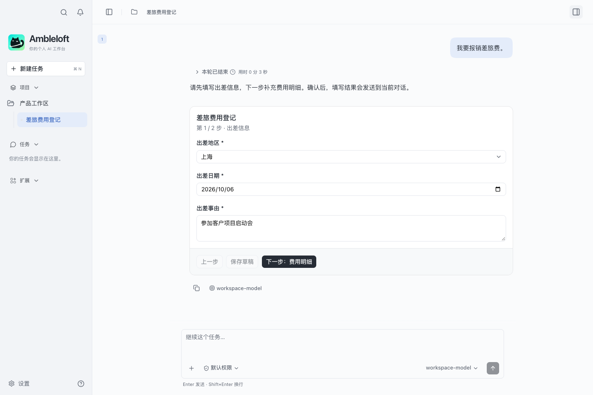
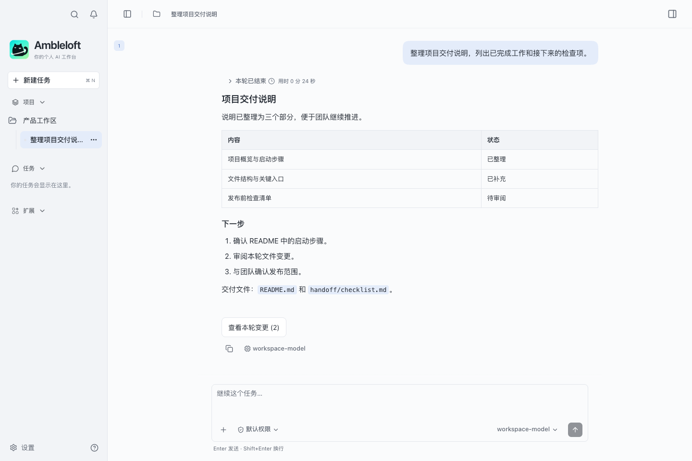

<div align="center">
  
  <h1>Ambleloft</h1>
  <p><strong>构建可交互的 Agent 应用。</strong></p>
  <p>将表单、交互界面和业务操作带入 AI 对话。</p>
  <p><a href="README.md">English</a> · <strong>简体中文</strong></p>
  <p>开源桌面工作台 · 自选模型 · JavaScript / TypeScript 扩展 · Apache-2.0</p>
  <p><a href="#体验差旅表单">体验示例应用</a> · <a href="#开发第一个扩展">开发第一个扩展</a></p>
</div>

**你构建业务能力，Ambleloft 提供用户与 Agent 协作的界面和运行环境。** 用扩展把业务流程带入聊天，让用户从一句需求开始，填写信息、确认操作、查看结果。使用熟悉的 JavaScript / TypeScript 和 npm 包，为自己的工作场景构建应用。

面向 **Windows、macOS 和 Linux**。当前为 **0.3.0 开发预览**，已验证 macOS Apple Silicon；Windows / Linux 发行包尚未提供。下文扩展能力以当前源码为准，体验最新功能请从源码运行。

## 从一句需求，进入应用

> **用户：** 我要报销差旅费。
>
> **Agent：** 展示「差旅费用登记」表单。
>
> **用户：** 选择地区，填写金额和日期，检查信息后确认发送。
>
> **应用：** 将结构化信息带回当前对话，供后续任务使用。

这是仓库中可以体验的[差旅表单示例](examples/skills/travel-expense/SKILL.md)。用户直接填写真实控件；字段、校验和提交方式由模板定义。当前示例将信息发送到聊天，并未向报销系统提交。

接入业务系统时，你可以把表单提交连接到扩展的后端操作。对于更长的流程，声明式表单支持线性多步骤、草稿保存和提交确认；需要定制界面时，可以使用当前有限支持的 MCP Apps 适配，在聊天中展示扩展提供的 HTML/JS。

[查看表单开发指南](specs/extensions/declarative-forms-guide.md) · [查看聊天内 UI 示例](examples/extensions/task-form/README.md)



*截图使用当前真实组件、模拟数据和两步演示模板，展示第 1 步「出差信息」，下一步填写费用明细。仓库差旅 Skill 是更精简的单步示例；两者均不代表已接入报销服务。*

## 为你的 Agent 应用提供三层能力

### 让对话成为应用入口

用 Skill 定义 Agent 何时使用你的能力，用表单或任务内 UI 收集用户输入，再由扩展操作执行业务逻辑。交互界面、Agent 可调用的操作和后端逻辑可以随同一个扩展交付。

例如，费用登记需要金额和日期，服务申请需要选择项目并补充说明。你定义应用需要什么信息，工作台提供展示、校验与确认交互。

### 用 npm 生态实现业务能力

复用已有的库处理数据、生成文档或连接服务。扩展提供受用户信任后运行的 Node.js 后端，以及隔离的前端页面；运行依赖可以打包进扩展目录，或 bundle 到产物中。

用户安装扩展时无需运行 npm，也无需安装系统 Node。开发者需要准备好依赖；含原生模块的包仍需验证目标平台和宿主 ABI 兼容性。

### 在同一个工作台里完成协作

Ambleloft 提供项目上下文、模型连接、对话历史、执行审批和结果审阅。扩展可以声明自己的设置、业务操作与消息入口，复用宿主的权限校验和交互机制。

**接下来的方向：让扩展围绕关联任务持续工作。** 我们希望扩展能够订阅任务进展，将聊天内容整理为摘要、待办和业务记录。公共任务订阅 / Agent hook SDK 尚未开放，这部分属于路线图。

## 开发第一个扩展

从仓库的 TypeScript 示例开始，查看页面、后端操作和 manifest 如何协作。在完成下方源码环境安装后运行：

```bash
npm run extensions:sdk
npm run extensions:demo
```

按照[示例说明](examples/extensions/project-card/README.md)安装生成的扩展，再替换为自己的界面和业务逻辑。

| 想构建的能力 | 从这里开始 |
| --- | --- |
| 聊天中的字段与分步表单 | [声明式表单指南](specs/extensions/declarative-forms-guide.md) |
| 聊天中的定制 HTML/JS 界面 | [任务内 UI 示例](examples/extensions/task-form/README.md) |
| 独立页面与后端业务操作 | [Project Card 示例](examples/extensions/project-card/README.md) |
| 消息操作与业务认证 | [消息操作和认证接入](specs/extensions/message-actions-auth-guide.md) |
| SDK、依赖准备、校验与打包 | [扩展开发指南](specs/extensions/developer-guide.md) |

SDK 和扩展 API 当前为开发者预览。仓库 SDK 可构建为本地 npm 包，尚未发布到公共 npm registry；扩展商城尚未实现。

## 工作台已经提供什么

| 能力 | 用在你的工作流中 |
| --- | --- |
| 自选模型 | 连接本地、局域网或云端兼容端点，配置多个服务；支持 Responses API 和 Chat Completions 适配。 |
| 项目上下文 | 关联项目文件夹、添加文件附件，并排浏览文件。 |
| 可见的执行过程 | 查看流式回复、工具活动、任务计划、问题收集与操作审批，随时停止任务。 |
| 结果审阅 | 展示 Markdown、代码、公式、Mermaid、ECharts、SVG 和基础 draw.io；查看逐轮文件变更及只读差异。 |
| 会话延续 | 本地 SQLite 历史、草稿、归档搜索与恢复，以及逐轮模型和技能记录。 |
| 可复用技能 | 创建、导入、编辑和选择本地 SKILL.md 技能包。 |
| 桌面体验 | 中英文、深浅色主题、可折叠面板，以及支持格式的文件和 Office 预览。 |

文件差异来自本轮执行前后的目录快照，可能包含外部修改，并有大小与数量限制；它用于审阅，不提供 Git 提交或回滚。



*当前真实界面，使用模拟项目内容与桌面接口。*

## 当前状态与路线图

| 状态 | 范围 |
| --- | --- |
| 当前源码可体验 | 聊天表单、线性多步骤、草稿与确认提交、Node.js 扩展后端、隔离页面、业务操作、设置、消息操作及 OIDC 认证接入。 |
| 有限预览 | MCP Apps 任务内 UI；不代表任意远程 MCP 或完整 ChatGPT Apps 兼容。 |
| 后续方向 | 扩展订阅关联任务的聊天与进展，用于摘要提取和后续业务处理。公共 Agent hook SDK 尚未开放。 |
| 目标平台 | Windows、macOS、Linux；当前仅验证 macOS Apple Silicon，现有打包流程不提供 Windows / Linux 发行包。 |

项目持续开发，API 尚未稳定。上述能力不代表此前发布的 0.2.1 安装包均已包含。Ambleloft 连接现有模型端点，模型下载和推理运行时管理不在当前范围内。

[当前能力与契约](specs/extensions/current-capabilities.md) · [更新记录](CHANGELOG.md)

## 体验差旅表单

1. 按下方步骤从源码启动桌面应用，连接支持兼容工具调用的模型。
2. 在技能管理中导入仓库的 `examples/skills/travel-expense` 技能包。
3. 在新任务中选择该技能，输入「我要报销差旅费」。
4. 填写 Agent 展示的表单，确认后将结果发送到聊天。

## 从源码运行

需要 macOS、**Node.js 22.13+**（建议 Node.js 24 LTS）及 npm。引擎准备步骤使用当前机器的架构。

```bash
git clone https://github.com/fjb040911/Ambleloft.git
cd Ambleloft
npm ci
npm run engine:prepare
npm run dev
```

应用使用官方 npm 包中的固定版本 Codex app-server 引擎，无需另外安装 Codex CLI、官方 Codex 或 ChatGPT 桌面应用。引擎在本机下载、准备，不提交到本仓库。

运行生产前端构建：

```bash
npm run build
npm start
```

`npm run dev:web` 仅提供浏览器界面预览。本地文件访问和 Agent 执行需要桌面应用。

<details>
<summary>Office 预览：依赖与支持范围</summary>

## Office 预览

桌面应用可从项目文件面板或交付文件的预览按钮打开 Excel（`.xlsx` / `.xls`）及 PowerPoint（`.pptx` / `.ppt`），预览均为只读。

- Excel 支持工作表切换、已保存的格式化单元格值及虚拟滚动；不重新计算公式，不完整还原图表、合并单元格和样式。
- PowerPoint 支持缩略图、翻页、缩放及 PPTX 演讲者备注；旧版 PPT 不显示备注，不播放动画，字体替换可能影响外观。
- PowerPoint 转换需要另外安装 **LibreOffice**，应用不内置该软件。macOS 可安装到 `/Applications` 或 `~/Applications`，也可通过 `PATH` 或 `AMBLELOFT_SOFFICE` 指定位置。未安装时会提示，仍可使用外部应用打开。
- 当前预览文件每两秒检查一次变化，更新失败时保留上次成功的预览，也可手动刷新。转换不修改源文件，缓存最多保留 12 个最近条目。
- 文件上限为 32 MiB；PPTX 最多 500 页；表格最多 100 个工作表、10,000 行、200 列，总计 200,000 个单元格，文本预算约 8 MiB。截断时会显示提示。

</details>

## 连接模型

1. 打开「设置 → 模型提供商 → 添加服务」。
2. 填入 Base URL、准确模型 ID 和 API Key；无鉴权的本地服务可留空密钥。
3. 选择适用协议，保存并测试连接。测试会发送少量请求，可能产生服务费用。
4. 新建对话，可选项目文件夹，然后发送任务。

Base URL 示例为 `https://api.example.com/v1`，不要追加 `/responses` 或 `/chat/completions`。公网端点要求 HTTPS；支持的本机与局域网地址可使用 HTTP。Agent 任务需要模型支持兼容的工具调用；原生网页搜索需要支持该能力的 Responses 服务。

## 数据与执行权限

「本地优先」描述工作台数据的存储方式，并不意味着模型一定在本地运行。提示词、所选文件和工具上下文可能发送到你配置的模型服务。

- API Key 通过 Electron safeStorage 加密保存，不回传渲染进程。
- 默认执行模式从只读开始，写入或提权需要审批。可选的完全访问模式允许不经逐次审批执行操作。
- 项目目录是工作上下文，并不保证它是唯一可读目录。
- 应用维护独立的引擎配置，不复用官方 Codex 的登录与配置。
- 为兼容早期开发版本，macOS 数据仍位于 `~/Library/Application Support/Atelier`，包含 `atelier.sqlite` 和独立的 `codex-home`。浏览器预览数据与桌面版分离。

## 构建 Mac 应用

```bash
npm run package:mac   # 构建当前 Mac 架构的 .app
npm run dist:mac      # 在 release/ 生成 .app、DMG、ZIP 和校验文件
```

本地包使用 ad-hoc 签名，不是经过 Apple 公证的正式分发版本。正式签名与公证发布需要配置 Developer ID 签名及 Apple 公证凭据，再运行 `npm run release:mac`。

## 开发与验证

技术栈：Electron、React、TypeScript 和 Vite。

```bash
npm test                         # 单元与本地集成测试
npx playwright install chromium
npm run test:e2e                  # 浏览器界面测试
npm run test:desktop              # 使用本地模拟模型服务的桌面冒烟测试
npm run test:codex                # 固定版本引擎集成测试
npm run test:credentials          # 重启后的密钥持久化验证
node scripts/capture-readme.mjs   # 使用已安装的 Chrome 和演示数据重新截图
```

桌面验证在 macOS 上运行，可能使用系统钥匙串。本地模拟服务测试不代表对所有第三方模型服务的兼容性保证。

内部规划 `docs/`、生成产物 `output/`、`outputs/`、依赖、引擎二进制、用户数据和构建输出不提交 Git。运行所需资源由初始化与构建脚本准备。

## 反馈与贡献

欢迎[提交 Issue](https://github.com/fjb040911/Ambleloft/issues)，附上复现步骤、应用版本、操作系统版本和模型服务/协议信息。分享日志前请移除密钥、私有文件及敏感对话。较大的改动请先通过 Issue 讨论，再提交 PR。

## 许可证与致谢

Ambleloft 使用 [Apache-2.0](LICENSE) 许可证。第三方组件保留各自许可证，参见 [THIRD_PARTY_NOTICES.md](THIRD_PARTY_NOTICES.md)。

Ambleloft 是独立项目，并非 OpenAI 官方产品。项目使用 Codex 引擎、Electron、React、Vite、Lucide 等开源组件。
