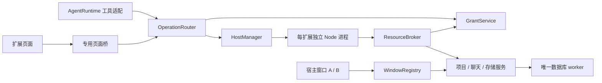

# M1 实现设计（待评审）

日期：2026-09-28。约束来自 [已确认范围](./scope.md)，代码证据见 [审查映射](./code-audit.md)。本文是可审查的实现提案；新增技术选型和数值不伪装为已批准 API。完成评审与协议探针后才交付功能开发。

## 1. 组件与责任

Windows、macOS、Linux 都是正式发行目标。核心契约、状态机及权限逻辑保持平台无关；进程、窗口、文件系统、凭据和分发差异由适配层收敛。每个平台必须通过真实运行和发行产物验收，详见 [跨平台架构要求](./platform-support.md)。macOS 探针通过不代表其他平台通过，也不改变三平台发行范围。

新增模块建议放在 core/extensions：manifest、packages、hosts、operations、grants、resources、storage；Electron 适配放 electron/extensions：process-adapter、page-host、page-preload、asset-protocol；窗口身份由 electron/window-registry 管理。名称是实现建议，不要求机械拆成大量小文件。

主进程只做授权、路由、包状态协调，不执行扩展入口。新包解压和复杂 schema 编译放有超时与配额的 worker，避免阻塞主 UI；扩展 Node 独立进程负责业务逻辑。所有状态写入经过现有 DB worker，进程和页面持有客户端接口而非 DB 对象。

## 2. HostManager

建议使用 Electron `utilityProcess.fork` 运行宿主自带 bootstrap，再 import 包内 main；它自带 Node 和消息通道，不额外依赖 PATH 中的 Node。记录并验证实际 Electron/Node/ABI；package.json 的 node>=22.13 是开发要求，不能当作扩展支持版本证明。原生依赖必须匹配实际 ABI 并经目标平台发布包探针，不能默认承诺所有 npm 包可运行。

实例键 `(profileId, extensionId)`；同一实例仅一个 active generation。activation promise 去重；实例切换增加 generation，旧页面/旧 handler 回复不能归入新实例。状态为 dormant→starting→active→stopping→stopped，失败进入 failed/recovering/paused；enabled/trusted/grants 是独立持久状态。

activate(context) 期间绑定清单 handler；校验全部必需 handler 完整后 active。命令/页面首次需要后台、Agent 操作或 onStartupFinished 触发激活。界面入口不依赖 activate。后台连接异步进行，不能因服务器离线而让 activate 无限等待。

建议默认：激活 10 秒，deactivate 5 秒，操作 30 秒、最高 120 秒；每扩展同时执行 4 个操作、等待队列 32 个（含等待时间统一 deadline）。超额返回 BUSY。后台心跳每 5 秒，连续 3 次失败标记无响应；先阻止新调用并诊断，再按故障策略终止/恢复，单次操作超时不杀进程。退避 1/5/15 秒，稳定 5 分钟重置计数。数值集中在宿主内部配置，不能由插件无限放大。

env 显式允许代理、证书、语言等必要项，不继承模型密钥、调试注入变量及全部 process.env；cwd 为包目录，不暗含当前项目。stdout/stderr 为限长日志，不作 RPC。禁用时先拒绝新请求、撤销通道/授权会话、取消排队调用，再清理与终止进程。存储保留。宿主退出前先停止扩展和 Agent，再关闭 DB，不能让扩展回调访问已关闭数据库。

## 3. 包、信任与更新

建议扩展包为 ZIP，后缀 `.amble-extension`，根目录有 extension.json。允许纯 JS、已编译产物和携带依赖；不运行安装脚本。不沿用现有 Skill importer 跳过 node_modules 的规则。

解包到 staging；拒绝绝对路径、..、驱动器路径、反斜线歧义、符号/硬链接、重复与大小写碰撞、特殊文件及嵌套归档自动展开。建议压缩包 100 MiB、解压总量 250 MiB、文件 10000 个、manifest 256 KiB。每个引用路径 realpath 后仍须位于包内。默认按文件内容和相对路径排序计算摘要，信任记录绑定实际字节及版本，不只绑定自填 publisher。

校验→不可变 revision 目录→信任确认→启用。未信任只显示宿主元数据，不加载其 HTML/JS。包路径由宿主确定，renderer 不能提交任意本机路径要求执行。开发目录显式选择；Node 重载前重新校验，代码变化在用户明确的开发信任范围内，权限扩大仍重新申请。

更新在扩展串行锁内完成：校验新 revision，记录 pending 更新，停止旧实例，事务切换 active revision，启动新实例。文件先就绪再切 DB 指针；崩溃后从持久 pending 记录恢复为可诊断状态，不执行两版本。不删除旧 revision；启动失败保留新失败记录，用户选择恢复旧代码并确认数据风险。每个新 revision 都确认代码信任；不把相同 ID 当作来源认证。卸载移除安装注册/授权/信任与运行实例，按用户选择保留数据；重装须重新信任授权。

## 4. 页面与窗口

建议使用 WebContentsView 容纳包内页面，主 UI 留一个内容矩形，宿主管理位置和焦点；不使用扩展 HTML 注入 React DOM，不复用主 preload。`sandbox:true`、`contextIsolation:true`、`nodeIntegration:false`，专用 session/partition 和 preload，只暴露 WebviewClient。

正式资源使用专有安全 scheme，每扩展 revision 隔离来源，只能读取声明 web root 的文件，不可访问后台源码、node_modules 或宿主路径。宿主处理路径归一化、MIME、CSP 和不存在资源。正式页 connect-src 限于所需本地资源，业务网络经后台；开发模式仅允许用户选择的 loopback origin 和 HMR WebSocket，不是允许任意网页拥有桥。

主 frame 身份、webContents、profile、extension revision、page instance 由宿主绑定。iframe/外部导航均不继承身份；外链通过宿主打开系统浏览器，销毁或导航先撤销桥。每个窗口各有页面实例，但后台只有一个。切换离开页面视为关闭，取消其调用；页内 SPA 路由不销毁实例。设置、授权弹层出现时隐藏 native view，防止盖住审批；恢复时重新计算边界，覆盖缩放、窗口 resize、键盘焦点和屏幕阅读验证。

WindowRegistry 替换单个 window 变量，区分宿主窗口和扩展 webContents；不得只检查 URL。窗口请求携带宿主绑定 windowId，后台不能随意抢占当前窗口。页面发起项目选择使用所属窗口；Agent 交互使用其执行关联窗口，无交互窗口返回 INTERACTION_REQUIRED。跨窗口广播仅发送同 profile 可见状态。

## 5. 资源级写入与稳定聊天身份

将宿主 UI 的 workspace:save 全量覆盖迁移为事务命令：project.create/update/delete、draft.create/update/archive、settings.patch，携带 expectedRevision；冲突返回 CONFLICT 并刷新，不自动覆盖。project 删除及草稿解绑在事务中，已运行聊天沿用明确的解绑策略。迁移期旧整份写入入口须要求 workspace revision，未迁移窗口禁止写入；不能仅让扩展使用新 API 而保留旧 UI 无条件写入。

已确认：扩展创建的聊天在草稿、首次发送和继续执行期间保持同一 conversationId，只有复制为新聊天才生成新 ID。

实现建议：新增 conversation identity 映射 `(conversationId, kind, recordId, projectId)`：现有 runs/drafts 各分配持久 UUID，旧 UI 的 recordId 保留。新聊天创建为 draft，允许空 initialPrompt；首次用户发送时由唯一 AgentRuntime 转成 run，原子更新映射并删除 draft，conversationId 不变。禁止“复制为新聊天”冒充“继续同一聊天”；复制必须生成新 identity。扩展拿到 conversationId，不拿模型 threadId。

M1 公共创建仅要求项目授权，不自动 startRun。持久化成功才返回引用，创建和打开是两个 API；Agent 可以创建但不抢焦点，打开需用户可见交互路由。并发创建不能丢记录。AgentRuntime 内存与 DB 更新保持单所有者，不能独立写 runs 再被 persist 覆盖。

profile 建议为当前 userData 下一个持久 default ID，M1 不做多账号切换 UI；结构与键预留 profileId，测试两个隔离目录。多窗口仍须在同一主进程通过锁共享协调器。

## 6. Operation 与授权

契约见 [SDK](./contracts/sdk.d.ts) 和 [清单 schema](./contracts/extension.schema.json)。操作按清单发现，handler 只能绑定已声明 ID。每个操作使用 extensionId.localName 的稳定 ID，输入输出均为 JSON object；初版不传文件句柄、函数、图片二进制或流。

宿主首先验证 caller exposure，再校验 input schema、when/enablement、生命周期和权限。需要项目的操作显式要求 inputs.projectId 且绑定到 operation context；handler 不可依赖全局当前窗口。Node 在处理函数中使用 context.resources，宿主按 invocationId 查找授权上下文；不能在并行调用间共享可变“当前授权”。资源 API 每次重查授权/项目存在性，返回前检查授权版本。声明权限是上限，操作 requiredPermissions 是预检集合；不能因预检通过而跳过实际资源检查，也不能读同一扩展授权的其他项目来绕过该次 project 绑定。

`effect:read|write` 与新增 risk 声明用于审批和展示，不是 Node 沙箱。已授权读取不再确认；write 默认确认。risk 描述可撤销性及 external/destructive/bulk/permissions 影响，缺失时按未知处理、逐次确认。开发者不能直接声明 approval=never；宿主规则可提高风险等级，不能因用户既有普通免确认策略降低重要操作等级。

普通可撤销、无重要影响的修改具备申请免确认资格。用户在宿主确认或设置中主动开启，建议按 `(profileId, extensionId, operationId, projectId, caller, contractDigest)` 存储；页面和 Agent 选项分别明确展示，不默默跨来源授权。非 projectScoped 写操作在 M1 不提供持久免确认，避免暗含全局项目授权。合同摘要覆盖 effect/risk、输入输出结构、权限、处理器与描述；代码更新默认暂停既有免确认，需用户重新选择。此处字段为技术建议，产品策略已确认。

宿主提交组件采用 prepare→host confirm→dispatch：绑定来源页面/Agent 请求、扩展 revision/generation、operationId、projectId、规范化参数摘要和权限版本；用户确认后由宿主直接派发，不向扩展颁发可复用的“已批准”布尔值。参数变更、新 revision、撤权、通道销毁或确认超时使确认失效。一次确认仅一次派发，跨窗口与重放不得复用。审批等待尚未启动 handler；派发 deadline 从确认并重新校验后开始。用户取消确认返回 CANCELLED/notStarted。

页面业务表单收集参数后，宿主呈现目标、影响与提交动作，将平台确认作为表单提交的最后一步，不先做一次等价确认再弹窗。组件由宿主渲染在可信区域或弹层中，不将“可信按钮”注入扩展 DOM；没有免确认授权时，纯扩展按钮点击不能代替宿主确认。风险描述不得仅使用扩展自由文案掩盖真实参数；确认界面可展开实际载荷，按敏感字段规则脱敏。参数无法明确呈现时不提供免确认。

Agent 复用同一策略判定和宿主审批卡；现有 full 模式不绕过该策略。outcomeUnknown 或重试仍重新检查权限，不因已有确认自动重放。requestId 只做在途关联，不承诺外部写入幂等。

调用超时/取消后关闭等待、发送 AbortSignal，保留实际 handler 状态诊断；占用槽位直到 handler 结束或 Host 终止，防止不合作 handler 绕过并发限制。副作用可能已发生时返回 effectStatus:unknown，未派发返回 notStarted，不自动重放。已取消的迟到结果不能再次完成同一个请求。

GrantService 保存 `(profile, extension, capability, projectId)`，扩展 scoped 权限使用 self。声明变更只增加请求资格，不能增加授权。项目选择器可结合权限确认，不返回未选项目列表；Node 自身不能弹窗。背景请求 grant 返回 INTERACTION_REQUIRED，页/Agent 交互层主动发起申请。扩展专属 secrets 仅 Node 可读写，页面设置凭据通过宿主输入 UI，避免通用 secrets.get 暴露到页。

## 7. Agent 接入方案与验证门槛

> A6 实现决策：因 A0 旧线程追加 dynamicTools 失败，已改用统一、每执行独立的内部 MCP，并完成固定引擎双协议验证。以下 dynamicTools 段落保留为原始方案背景；现行实现及凭证/审批规则以 [A6 记录](./a6-results.md) 为准。

优先使用固定版本的 dynamicTools，不在 chat-bridge 拼接私有工具执行循环。新线程声明两个宿主内置工具 `extension_list_operations` 与 `extension_invoke_operation`：list 仅返回当前项目、信任、授权与 agent exposure 满足的操作描述及 schema；invoke 接收 operationId 与 input，内部二次校验具体 schema。工具外层 schema 固定，输入业务字段由宿主检查，不宣称提供方已为每个业务操作做结构化约束。

工具调用以 request 所在 rpc/context 绑定 run/thread/turn/project，模型提供的 profileId/windowId 不参与身份判断；cross-project 调用首版拒绝，要求切换对应项目执行。page-only 不出现在目录且不可通过 invoke 猜测调用。启停/撤权在下一次查询和调用立即生效，无需重建线程。

新引擎线程以固定两工具开始；resume 不传 dynamicTools（该版本没有此字段）。开发前必须用隔离本地 fixture 验证工具在恢复线程中仍可调用、旧线程如何加入口、experimentalApi 握手和两种模型协议适配。若旧线程无法增加动态工具，候选为宿主内部 MCP 分发适配，沿用固定工具但连接按执行上下文隔离；这不等于开放清单 MCP binding。不得静默清空历史或自动替换引擎版本来“解决”。该探针为任务 A0 阻塞项，决定方案后补录协议契约。

## 8. 存储、迁移与打包

DB 增量迁移建议从 user_version=2 到 3，新表：extension_installations、extension_revisions、extension_grants、extension_kv、extension_secrets、conversation_identities；安装/权限等表含 profileId 和 extensionId，核心表不暴露给插件。普通 KV 每扩展建议 10 MiB，单值 256 KiB；secrets 经现有 safeStorage 加密，密钥不可用时报错。配置依清单 properties 校验，普通配置不存 token。

建议持久记录的最小键与数据如下；字段结构先走一次 DB 迁移，不能靠随意写 settings 模拟跨表事务：

| 表 | 主键/关键字段 | 约束 |
| --- | --- | --- |
| extension_installations | profileId, extensionId；activeRevision, enabled, pendingRevision, generation | 每配置每扩展一个记录，激活状态不当作持久进程事实 |
| extension_revisions | extensionId, digest；manifest, relativePath, trustConfirmedAt | 包不可变，摘要验证后注册；信任记录另绑定 profile，不能跨用户配置继承 |
| extension_grants | profileId, extensionId, capability, resourceKey；revision | resourceKey=self 或 project:<id>，不存在通配项目授权 |
| extension_kv | profileId, extensionId, key；value, revision, deleted | tombstone 防止 revision ABA；总额在事务内检查 |
| extension_secrets | profileId, extensionId, key；ciphertext | 加密失败不写入明文，不返回宿主全量凭据 |
| conversation_identities | conversationId；kind, recordId, projectId | kind+recordId 唯一，draft→run 与草稿删除同事务 |

extension_revisions 的包摘要可共享存储，但信任必须记录在 profile 隔离的安装/信任记录上，表中 trustConfirmedAt 仅作审计，不可单独授权。installation 更新、旧格式迁移完成标志和 UI snapshot revision 在事务中提交；失败时旧记录仍可用。进程内缓存只在 DB 提交成功后更新，再向窗口发布 revision。文件垃圾回收只清理无引用 staging，不能删除仍用于历史或回退的包。

旧 platform.extensions.v1 通过一次性迁移规范化为内部 text page contribution，保留原 ID/enabled；不能因为旧版本已 enabled 就授予新 Node 代码信任。新 ZIP 可由同 ID 替换，但必须经过完整信任。旧 source 只作迁移备份，统一注册表不同时发布两个来源；坏记录隔离并报告，不影响其他扩展或聊天。

SDK 作为轻量客户端随包 bundle；无全局 node_modules 注入，无 import 宿主内部包。bootstrap 传入连接后 SDK 创建上下文。校验器和 preload bundle 必须包含在发布文件清单；包内依赖与宿主工具链依赖分离。脚手架本阶段只做最小 Demo，不编写 PM 业务服务。

## 9. i18n、条件与通用贡献的分步落地

manifest 可显示字符串支持 %key%，读取默认 extension.nls.json 和 locale 覆盖，精确 locale→基础语言→默认，不翻译 ID。缺 key 打包失败，运行时诊断回退键名。宿主 t() 保持应用文案，扩展词典单独命名空间。

M1 schema 先支持首页、操作、设置、Skills 及页面导航命令。条件使用自有 parser：!、&&、||、括号、布尔/数值/字符串比较，禁止 eval；键仅限 schema 声明、内置 project.exists 和 ext.<id>.*。扩展 context 仅 self namespace、profile 作用域，停用清理；页展示不决定服务端授权。完整树 provider、菜单插槽及更广条件语法保留整体架构但不成为本轮基础闭环前置，发布前列明支持的 manifest 版本。

## 10. 评审点及未验证事项

R1 稳定聊天身份已确认：草稿→首次发送→继续执行保持同一 conversationId，复制产生新 ID；打开聊天仍不自动执行，窗口路由沿用第 4–5 节方案。操作确认的风险分层与宿主提交组件方向已确认，细节见第 6 节。技术建议：R3 utilityProcess＋WebContentsView、包格式与数值可集中评审。A0 引擎恢复探针和打包 Node/ABI 探针是技术验证门槛，不能由文档推断通过。

M2 当前仅预留：资源 identity、可等待的持久写入、profile/extension 隔离和 generation。不能把 UI publish 当可靠 Hook；未来须在轮次终态与 outbox 同事务提交后通知。M1 不建空的永久队列或假实现提示词服务。

参考：[Electron utilityProcess](https://www.electronjs.org/docs/latest/api/utility-process)、[WebContentsView](https://www.electronjs.org/docs/latest/api/web-contents-view)、[Electron 安全指南](https://www.electronjs.org/docs/latest/tutorial/security)。参考当前官方 API，但实际可用性必须以仓库锁定 Electron 41.10.7 的打包探针验证。
